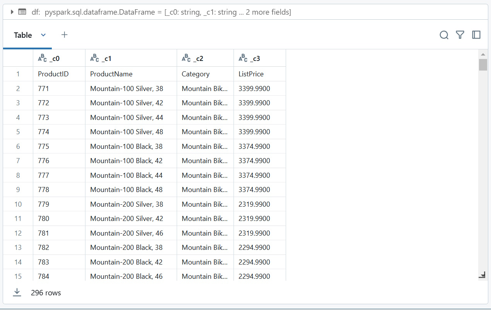
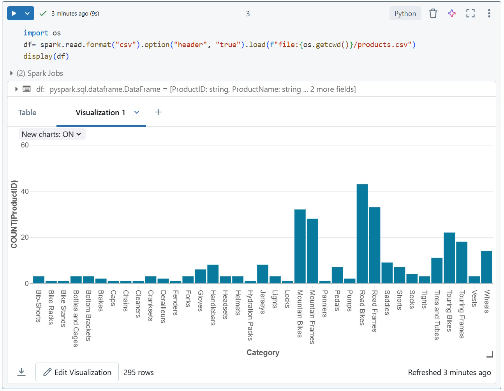

# Create First Notebook #
As in many Spark environments, Databricks supports the use of notebooks to combine notes and interactive code cells that you can use to explore data.

## Task 1: Upload data to Dataframe ##
As in many Spark environments, Databricks supports the use of notebooks to combine notes and interactive code cells that you can use to explore data.

Download the [products.csv](resources\products.csv) file to your local computer, saving it as products.csv. Then, in the sidebar, select **Workspace** icon.

Click on the **three vertical dots** menu, next to the **Share** button. From the dropdown menu, select *Import*.

In the Upload Data dialog box, select *Import from* **File** option, and choose the *products.csv* file you downloaded to your computer. When the file has been uploaded, select *Import*

In your workspace, the file *products.csv* should now appear.

Pulsa en el botón azul de
*Create* y escoge **Notebook** para crear uno nuevo.

Change the default notebook name *(Untitled Notebook [date])* to **Explore products** and in the *Connect drop-down list*, select your cluster if it is not already selected. If the cluster is not running, it may take a minute or so to start.

In the Explore products notebook, in the empty code cell, paste the code you copied; which should look similar to this:

```python
import os
df1= spark.read.format("csv").load(f"file:{os.getcwd()}/products.csv")
```

Use the **▸ Run** Cell menu option at the top-right of the cell to run it, starting and attaching the cluster if prompted.

Wait for the Spark job run by the code to complete. The code has created a dataframe object named **df1** from the data in the file you uploaded.

Under the existing code cell, use the *+* icon to add a new code cell. Then in the new cell, enter the following code:

```python
display(df1)
```

Use the **▸ Run** Cell menu option at the top-right of the new cell to run it. 

This code displays the contents of the dataframe, which should look similar to this:



Notice that the second row should actually be the header. To fix this, add a new cell at the end of the notebook and reload the DataFrame, this time specifying that the first row of the CSV is the header:

```python
import os
df= spark.read.format("csv").option("header", "true").load(f"file:{os.getcwd()}/products.csv")
display(df)
```

Above the table of results, select + and then select **Visualization** to view the visualization editor, and then apply the following options:

* Visualization type: *Bar*
* X Column: *Category*
* Y Column: Add a new column and select *ProductID*. Apply the *Count* aggregation.

Save the visualization and observe that it is displayed in the notebook, like this:



A bar chart showing product counts by category

## Task 2: Create and query a table ##
While many data analysis are comfortable using languages like Python or Scala to work with data in files, a lot of data analytics solutions are built on relational databases; in which data is stored in tables and manipulated using SQL.

In the **Explore products** notebook, under the chart output from the previously run code cell, use the *+* icon to add a new cell.

Enter and run the following code in the new cell:

```python
 df1.write.saveAsTable("products")
```

When the cell has completed, add a new cell under it with the following code:

```python
 %sql

 SELECT ProductName, ListPrice
 FROM products
 WHERE Category = 'Touring Bikes';
```

Run the new cell, which contains SQL code to return the name and price of products in the *Touring Bikes* category.

In the sidebar, select the **Catalog link**, and verify that the **products** table has been created in the default database schema (which is unsurprisingly named **default**). It’s possible to use Spark code to create custom database schemas and a schema of relational tables that data analysts can use to explore data and generate analytical reports.